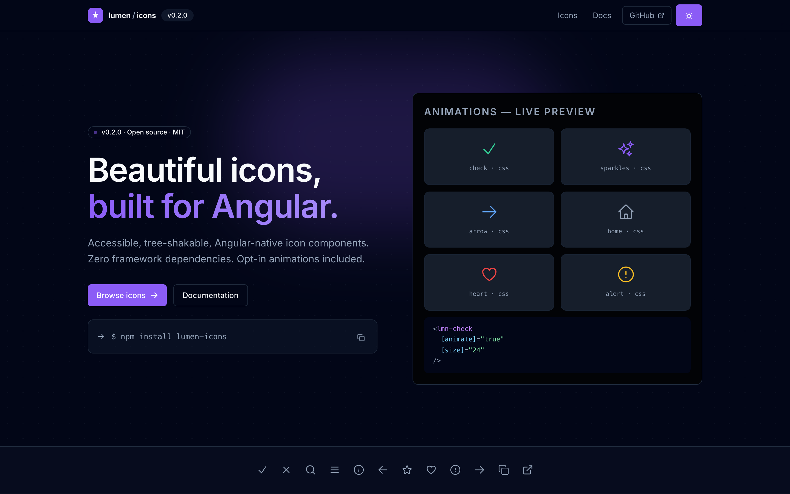
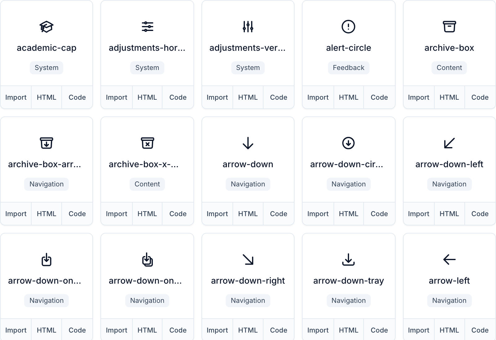
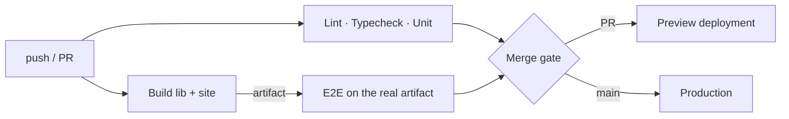

<div align="center">


# lumen-icons

### 362 accessible, tree-shakable icon components — built for Angular, not ported to it.

**Every icon is a standalone Angular component with its own entry point.**
**Import one, ship one.** Outline + filled variants, opt-in CSS animations, zero styling opinions.

<br/>

[](https://www.npmjs.com/package/lumen-icons)
[](https://angular.dev)
[](https://lumen-icons.andersseen.dev/icons)
[](LICENSE)

[](https://github.com/Andersseen/lumen-icons/actions/workflows/ci.yml)
[](https://lumen-icons.andersseen.dev)
[](https://www.npmjs.com/package/lumen-icons)
[](#-why-lumen-icons)
[](https://github.com/Andersseen/lumen-icons/stargazers)

[**🚀 Quick start**](#-quick-start) · [**🎨 Browse all 362 icons**](https://lumen-icons.andersseen.dev/icons) · [**📖 Docs**](https://lumen-icons.andersseen.dev/docs) · [**🧩 API**](#-icon-api) · [**✨ Animations**](#-animations--opt-in-and-css-only) · [**🤝 Contributing**](CONTRIBUTING.md)

<br/>



</div>

<br/>

<div align="center">

## 🤔 Why lumen-icons?

</div>

Most icon sets reach Angular through a sprite sheet, a font, or a wrapper around a React-first library. You end up shipping the whole set to render three glyphs, and accessibility is left to you.

**lumen-icons is the opposite.** Each icon is a real standalone component with its own subpath export, so your bundler drops everything you did not import — and every icon is accessible by default.

| | lumen-icons | Icon fonts | Sprite sheets | React-first wrappers |
|---|---|---|---|---|
| **Ships only what you import** | ✅ per-icon entry points | ❌ whole font | ❌ whole sheet | ⚠️ depends on the wrapper |
| **Angular-native** | ✅ standalone + signals + OnPush | ❌ | ❌ | ⚠️ adapter layer |
| **Accessible by default** | ✅ `aria-hidden` / `role="img"` handled | ❌ manual | ❌ manual | ⚠️ varies |
| **Colour** | ✅ `currentColor`, inherits CSS | ✅ | ⚠️ | ✅ |
| **Animations** | ✅ opt-in, pure CSS, zero deps | ❌ | ❌ | ⚠️ JS runtime |
| **Styling opinions** | ✅ none — no Tailwind, no CSS reset | ❌ | ❌ | ⚠️ |
| **Copy-paste friendly** | ✅ one self-contained file per icon | ❌ | ❌ | ❌ |

<sub>**≈0.3 kB gzipped per icon.** All 362 icons together compress to ~112 kB gzipped — but you only ever pay for the ones you import.</sub>

<br/>

<div align="center">

## ⚡ Quick start

</div>

```sh
npm install lumen-icons     # or: pnpm add lumen-icons
```

**1. Import the single icon you need** — this is the import that keeps your bundle small:

```ts
import { Component } from '@angular/core';
import { LmnCheckIcon } from 'lumen-icons/check';

@Component({
  selector: 'app-save-button',
  imports: [LmnCheckIcon],
  template: `<lmn-check ariaLabel="Saved" [size]="20" />`,
})
export class SaveButtonComponent {}
```

**2. That's it.** The icon inherits colour from CSS — no theme provider, no config, no module:

```html
<span style="color: var(--brand)">
  <lmn-check />
</span>
```

<details>
<summary><b>Other import paths</b> (and when to use them)</summary>

<br/>

| Import | What you get | Use it when |
|---|---|---|
| `lumen-icons/check` | one icon | **Always prefer this** — best tree-shaking |
| `lumen-icons/icons` | barrel of every icon | Prototyping, or a dynamic icon picker |
| `lumen-icons` | types + every icon | You need `LmnIconSize`, `LmnIconVariant`, … |

```ts
import { LmnCheckIcon } from 'lumen-icons/check';      // ✅ preferred
import { LmnCheckIcon } from 'lumen-icons/icons';      // ⚠️ barrel
import type { LmnIconSize } from 'lumen-icons';        // types
```

</details>

<br/>

<div align="center">

## 🎨 362 icons, 9 categories

<a href="https://lumen-icons.andersseen.dev/icons">
  
</a>

**[→ Browse, search and copy any icon at lumen-icons.andersseen.dev/icons](https://lumen-icons.andersseen.dev/icons)**

</div>

<br/>

| Category | Icons | A few of them |
|---|---:|---|
| **System** | 159 | `academic-cap` · `adjustments-horizontal` · `at-symbol` · `avatar` · `bars-3` |
| **Navigation** | 81 | `arrow-right` · `arrow-down-tray` · `chevron-up` · `home` · `external-link` |
| **Content** | 27 | `document` · `folder` · `archive-box` · `bookmark` · `calendar-days` |
| **Actions** | 25 | `copy` · `download` · `edit` · `filter` · `cog-6-tooth` |
| **Feedback** | 21 | `check` · `check-circle` · `alert-circle` · `bell` · `heart` |
| **Communication** | 16 | `mail` · `phone` · `megaphone` · `chat-bubble-left-right` · `microphone` |
| **Security** | 13 | `lock` · `key` · `shield` · `eye-slash` · `finger-print` |
| **Media** | 11 | `play` · `pause` · `camera` · `photo` · `video-camera` |
| **Editor** | 9 | `bold` · `italic` · `underline` · `list-bullet` · `numbered-list` |

<br/>

<div align="center">

## 🧩 Icon API

</div>

Every icon accepts the same twelve optional inputs — all signal-based (`input()`), all with sensible defaults:

| Input | Type | Default | What it does |
|---|---|---|---|
| `size` | `12 \| 14 \| 16 \| 20 \| 24 \| 32` | `24` | Width and height in px |
| `strokeWidth` | `number` | `2` | Outline thickness |
| `ariaLabel` | `string` | — | Sets `role="img"` + the accessible name. Omit it and the icon is `aria-hidden` |
| `variant` | `'outline' \| 'filled'` | `'outline'` | Outline or solid rendering |
| `animate` | `boolean` | `false` | Runs the icon's CSS animation once |
| `tone` | `LmnIconTone` | `'inherit'` | Semantic colour token |
| `color` | `string` | — | Any CSS colour, overrides `tone` |
| `background` | `'none' \| 'soft' \| 'solid'` | `'none'` | Framed icon-button look |
| `backgroundTone` | `LmnIconTone` | `'primary'` | Tone of that frame |
| `backgroundColor` | `string` | — | Any CSS colour for the frame |
| `padding` | `number` | `0` | Padding inside the frame, px |
| `radius` | `number \| string` | `'0.5rem'` | Frame corner radius (`'50%'` for a circle) |

```html
<!-- Decorative: hidden from screen readers automatically -->
<lmn-check />

<!-- Meaningful: announced as "Saved" -->
<lmn-check ariaLabel="Saved" />

<!-- Framed, filled, circular icon button -->
<lmn-bell
  variant="filled"
  background="soft"
  backgroundTone="primary"
  [padding]="10"
  radius="50%"
  ariaLabel="Notifications"
/>
```

<sub>♿ <b>Accessibility is not opt-in.</b> An icon without <code>ariaLabel</code> is decorative and gets <code>aria-hidden="true"</code>; with one, it gets <code>role="img"</code> and an accessible name. There is no way to accidentally ship an unlabelled, screen-reader-visible icon.</sub>

<br/>

<div align="center">

## ✨ Animations — opt-in and CSS-only

</div>

Icons animate through **pure CSS `@keyframes` scoped to each component**. No animation library, no JS runtime, nothing in your bundle unless you ask for it.

```html
<lmn-check [animate]="true" />
```

Each icon is mapped to a **semantic recipe** — a check draws itself, an arrow slides, a heart beats, a loader spins — from ~70 recipes in [`scripts/animations.mjs`](scripts/animations.mjs). Only `loader` loops; everything else plays once and settles.

<sub>🧏 <code>prefers-reduced-motion: reduce</code> disables every animation automatically. <code>loader</code> is the only icon allowed to run <code>infinite</code>.</sub>

<br/>

<div align="center">

## 📦 What's in this repository

</div>

One repository, one `package.json`, a clear internal boundary between the shipped library and the site that documents it.

```
lumen-icons/
├── packages/icons/          → the published npm package (lumen-icons)
│   └── src/
│       ├── icons/           → 362 components, one file + one spec each
│       ├── lib/icon-base.ts → shared inputs and host bindings
│       └── types/
├── src/                     → the demo + docs site (AnalogJS, deployed to Cloudflare)
├── scripts/                 → icon generator, animation recipes, build & publish
├── tests/e2e/               → Playwright
└── docs/                    → architecture, conventions, specs, agent docs
```

| | |
|---|---|
| **Library** | Angular 21 · standalone · signals · OnPush · ng-packagr (APF) |
| **Site** | AnalogJS 2 · Vite 8 · Tailwind v4 · `@voltui/components` |
| **Tests** | Vitest 4 + Testing Library (unit) · Playwright (e2e) |
| **Quality** | ESLint · TypeScript strict · publint · commitlint + husky |
| **Deploy** | GitHub Actions → Cloudflare Pages |

<br/>

<div align="center">

## 🛠️ Development

</div>

```sh
pnpm install
pnpm run dev              # demo site on http://localhost:5173
```

| Command | What it does |
|---|---|
| `pnpm run check` | **The gate — run this before every PR** (lint + typecheck + unit + package) |
| `pnpm run build` | Build the library, then the site |
| `pnpm run build:lib` | Build `lumen-icons` via ng-packagr → `packages/icons/dist/` |
| `pnpm run test:unit` | Vitest, one shot (`:watch` for watch mode) |
| `pnpm run test:e2e` | Playwright (`:ui` for the interactive runner) |
| `pnpm run generate:icons` | Regenerate icons + animations from the source set |
| `pnpm run sync:icons` | Rebuild the barrel and the site catalog from icon files |
| `pnpm run preview:cf` | Serve the built site on the local Cloudflare runtime |

<details>
<summary><b>Adding an icon</b></summary>

<br/>

1. Create `packages/icons/src/icons/my-icon.ts` (component, `lmn-my-icon` selector, `LmnMyIconIcon` class).
2. Add `packages/icons/src/icons/my-icon.spec.ts` — at minimum a render + accessibility test.
3. Run `pnpm run sync:icons` to regenerate the barrel and the site catalog.
4. Run `pnpm run check`.

Full conventions: [`docs/ai/CONVENTIONS.md`](docs/ai/CONVENTIONS.md) · [`CONTRIBUTING.md`](CONTRIBUTING.md)

</details>

<br/>

<div align="center">

## ☁️ Deployment — one pipeline, one host

</div>

Every push runs a **single workflow** ([`.github/workflows/ci.yml`](.github/workflows/ci.yml)). The site is built **once** and that exact artifact is what gets tested and deployed — there is no second build, and no deployment path that skips the gates.



| Trigger | Result |
|---|---|
| **Pull request** | Preview deployment on a branch alias, URL posted back to the PR |
| **Push to `main`** | Production → **[lumen-icons.andersseen.dev](https://lumen-icons.andersseen.dev)** |

Deployments only ever happen from CI. Two repository secrets are required: `CLOUDFLARE_API_TOKEN` and `CLOUDFLARE_ACCOUNT_ID`.

<br/>

<div align="center">

## 🤝 Contributing

</div>

Issues and PRs are welcome — new icons especially.

- Read [`CONTRIBUTING.md`](CONTRIBUTING.md) first
- Conventional commits are enforced (`feat(icons): add lmn-arrow-right`)
- `pnpm run check` must pass before a PR is reviewed
- Be kind

<br/>

<div align="center">

## 📖 Documentation

</div>

| Doc | What's inside |
|---|---|
| [Live docs](https://lumen-icons.andersseen.dev/docs) | Installation, usage, every icon |
| [`docs/ai/ARCHITECTURE.md`](docs/ai/ARCHITECTURE.md) | How the library and generator fit together |
| [`docs/ai/CONVENTIONS.md`](docs/ai/CONVENTIONS.md) | Icon, component and commit conventions |
| [`docs/ai/STATE.md`](docs/ai/STATE.md) | Current status, known gaps, next milestones |
| [`docs/specs/`](docs/specs/) | Spec-driven process for non-trivial changes |
| [`CHANGELOG.md`](CHANGELOG.md) | Keep-a-changelog release history |

<br/>

<div align="center">

## 🙏 Credits

Outline and filled geometry is derived from **[Heroicons](https://github.com/tailwindlabs/heroicons)** (MIT) by the Tailwind Labs team, converted to standalone Angular components, plus custom icons drawn for this set.

Inspired by the ergonomics of [Lucide](https://lucide.dev) and [Radix Icons](https://www.radix-ui.com/icons).

<br/>

**[MIT](LICENSE)** © [Andrii](https://github.com/Andersseen)

<sub>If lumen-icons saved you time, a ⭐ helps other Angular developers find it.</sub>

</div>
